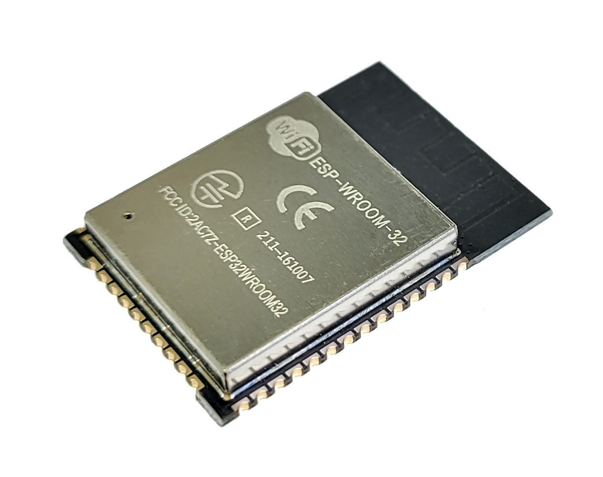
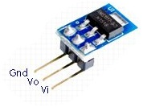
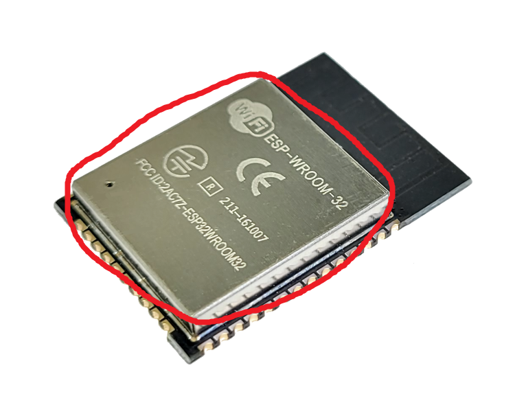
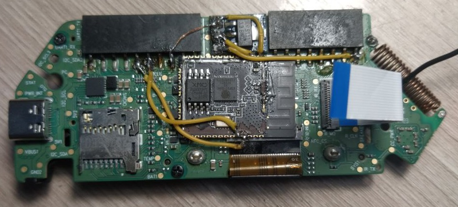
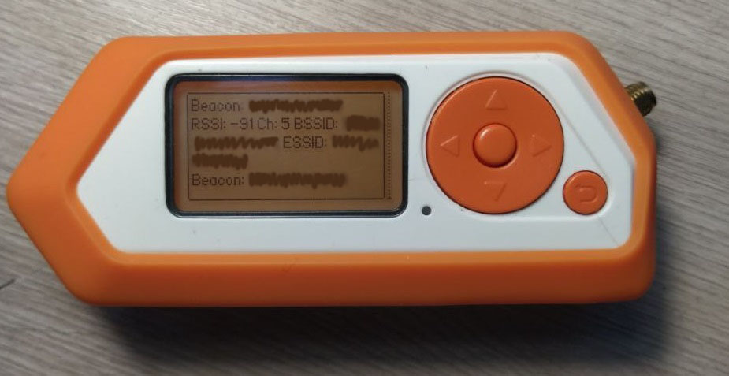
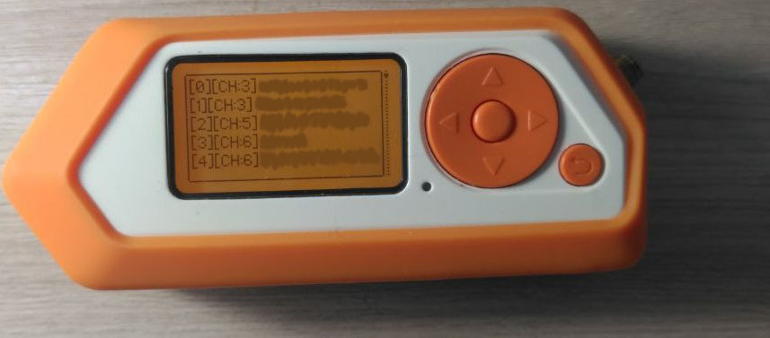

  
  <h1> ⚡ Installing ESP32 Inside Flipper Zero ⚡ </h1>

-----

Welcome to the **ESP32 Installation Guide** for Flipper Zero! 🎉  
This repository will demonstrate how to install an ESP32 inside the Flipper Zero.

## 📚 Table of Contents
- [🚀 What Will This Bring Me?](#-what-will-this-bring-me)
- [🛠️ What Types of Boards Would Be Suitable?](#️-what-types-of-boards-would-be-suitable)
- [📋 list of components.](#️-list-of-components)
- [🧑‍🔧 Let's Get Started with Soldering!](#-lets-get-started-with-soldering)
- [🎉 final outcome](#-final-outcome)
- [❤️ Support the project](#-support-the-project)
- [⭐ Star History](#-star-history)

-----

## 🚀 What Will This Bring Me?
The ESP32 is a module that operates with Wi-Fi and Bluetooth. When connected to the Flipper Zero, it enables various attacks such as deauthentication, handshake capturing, and many other possibilities.

-----

## 🛠️ What Types of Boards Would Be Suitable?
| Board Type          | Compatibility |
|---------------------|---------------|
| esp32-wroom-32      | ✅            |
| esp8266             | ➕➖          |
| esp32-C3 supermini  | ❌           |

*Note: If you're using the ESP8266, you won't be able to access certain features, such as handshake capture.*

-----
## 📋 list of components.

[esp32-wroom-32](https://sl.aliexpress.ru/p?key=G8OasiD)

[Transformer from 5V to 3.3V](https://sl.aliexpress.ru/p?key=HQOas0q)

-----
## 🧑‍🔧 Let's Get Started with Soldering!
However, please remember that the author bears no responsibility for any potentially damaged boards; you undertake all actions at your own risk!

1. To start, you need to desolder the metal cover from your ESP32 (or ESP8266).  
   

2. Now, open the Flipper Zero and disassemble it down to the main board with the display and buttons. For a detailed example of how to do this, refer to the article provided: [article](https://habr.com/ru/articles/599791/)

3. Now, arrange the ESP32 and the 5V to 3.3V converter on the motherboard.  
   

4. Now, please solder the ESP32 converter to the Flipper Zero as shown.

| esp32 | flipper |
|-------|---------|
|  TX   |  RX     |
|  RX   |  TX     |

| esp32 | converter |
|-------|-----------|
|3.3V   |Vo         |
|GND    |GND        |

| flipper | converter |
|---------|-----------|
|GND      |GND        |
|5V       |Vi         |

5. Now, we need to connect GPIO 0 to GND using tweezers or a wire on the ESP32. Then, switch to the ESP32 flasher on the Flipper and select the Marauder firmware to install.

6. Now, assemble the Flipper and, by entering the [ESP32]WiFi Marauder, you will be able to utilize the ESP32.

-----
## 🎉 final outcome

-----
## ❤️ Support the project
If you would like to show your support, you can star my repository or follow me! If you appreciate this project, consider buying me a cup of coffee to keep the energy flowing! ☕ Thank you for your support!

**BTC Address:** `bc1qvul4mlxxw5h2hnt8knnxdrxuwgpf4styyk20tm`

**ETH Address:** `0x5c54eAb2acFE1c6C866FB4b050d8B69CfB1138Af`

**LTC Address:** `LbdzCsYbxuD341raar6Cg1yKavaDq7fjuV`

**XRP Address:** `rKLLPzoBGfqY3pAQPwTFPRYaWjpHSwHNDw`

**ADA Address:** `addr1qyz2aku0ucmxqnl60lza23lkx2xha8zmxz9wqxnrtvpjysgy4mdcle3kvp8l5l7964rlvv5d06w9kvy2uqdxxkcryfqs7pajev`

**DOGE Address:** `DBzAvD62yQUkP4Cb7C5LuFYQEierF3D3oG`

Every donation you make is deeply appreciated and will help in the ongoing development of this project!

-----

## ⭐ Star History

<a href="https://www.star-history.com/#W0rthlessS0ul/flipper-zero-internal-esp32&type=date&legend=top-left">
 <picture>
   <source media="(prefers-color-scheme: dark)" srcset="https://api.star-history.com/svg?repos=W0rthlessS0ul/flipper-zero-internal-esp32&type=date&theme=dark&legend=top-left" />
   <source media="(prefers-color-scheme: light)" srcset="https://api.star-history.com/svg?repos=W0rthlessS0ul/flipper-zero-internal-esp32&type=date&legend=top-left" />
   
 </picture>
</a>

